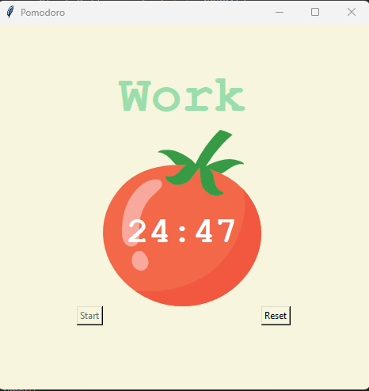

# Pomodoro Timer ⏲️🍅

The Pomodoro Timer is a simple Python application with a graphical user interface built using the tkinter library. It helps you manage your work or study sessions by providing timed intervals of work and breaks, following the Pomodoro Technique.

## Features 🚀

- Configurable work session duration (default: 25 minutes).
- Configurable short break duration (default: 5 minutes).
- Configurable long break duration (default: 20 minutes).
- Keeps track of work and break sessions 📈.
- Displays a checkmark for each completed work session ✅.
- Allows resetting the timer to start a new session 🔄.

## Getting Started 🏁

1. Clone this repository/fork  or download the source code.
2. Make sure you have Python installed on your system.
3. Install the required libraries using pip if you haven't already:
 ```
   pip install tkinter
```
4.Run the Pomodoro Timer main.py file:

# Usage 🧍‍♂️📅
- Click the "Start" button to begin a work session.
- The timer will display the remaining time for the session.
- After completing a work session, a short or long break will start automatically, depending on the number of work sessions completed.
- The timer will display a checkmark for each completed work session.
- Click the "Reset" button to reset the timer and start a new work session.

# Customization ⚙️
You can customize the timer durations by modifying the following constants in the code:

- WORK_MIN: Duration of a work session in minutes.
- SHORT_BREAK_MIN: Duration of a short break in minutes.
- LONG_BREAK_MIN: Duration of a long break in minutes.

# Advanced Features 🚀

Take your productivity to the next level with these advanced features and enhancements in our Pomodoro Timer:

### 1. Sound Notifications 🔊

Never miss a work or break session with customizable sound notifications. Choose from a variety of alert sounds or even add your own to keep you on track.

### 2. Pop-Up Notifications 🪟

Stay in the zone with pop-up notifications that automatically appear when it's time to switch between work and break sessions. Focus on your tasks, and let the timer notify you when it's time to take a break or get back to work.

### 3. Task Logging 📋

Stay organized and track your accomplishments by logging tasks and activities during work sessions. Review your completed tasks to measure your productivity and stay motivated.

### 4. Statistics and Reports 📊

Gain insights into your work habits with detailed statistics and reports. Visualize your productivity over time, identify patterns, and make data-driven decisions to improve your time management.

### 5. Customizable Themes 🌈

Personalize your timer's appearance with customizable themes and color schemes. Create a timer that suits your preferences and makes your work sessions more enjoyable.

### 6. Pause and Resume ⏸️▶️

Life happens, and sometimes you need to take a break. Our Pomodoro Timer lets you pause and resume work and break sessions, allowing you to manage interruptions seamlessly.

### 7. Task Integration 📅

Integrate with your favorite task management tools or to-do lists. Easily add tasks directly to your work sessions, helping you stay organized and focused.

### 8. Cross-Platform Support 🌐

Access your Pomodoro Timer from anywhere. We offer versions for different platforms, including macOS, Linux, iOS, and Android, so you can stay productive on your preferred device.

### 9. Sync Across Devices ☁️

Never lose your progress. Implement cloud synchronization to access your timer settings and session history on multiple devices. Stay in sync no matter where you are.

### 10. Pomodoro Technique Variations ⏲️

Explore different variations of the Pomodoro Technique to find what works best for you. Switch between methods like the 52-17 or the 2-1-2 to customize your work sessions.

### 11. Idle Detection ⏳

Our timer is smart! It detects when you're idle, with no keyboard or mouse activity, and automatically pauses the timer. When you return, it resumes your session right where you left off.

### 12. Task Breakdown 📆

Break down your work into smaller tasks or subtasks and allocate Pomodoro sessions to specific activities. Stay organized and focused on your goals.

### 13. Integration with Calendar 🗓️

Sync your Pomodoro sessions with your calendar apps. Schedule work and break sessions based on your existing commitments, helping you balance work and life seamlessly.

These advanced features are designed to supercharge your productivity and make your Pomodoro Timer experience even more efficient, enjoyable, and user-friendly. Explore them all to create a customized productivity workflow that works for you!


# Screenshots 📸


# Contributing 🤝
Contributions are welcome! If you'd like to contribute to this project, please follow these steps:

- Fork the repository.
- Create a new branch for your feature or bug fix.
- Make your changes and test them thoroughly.
- Commit your changes with descriptive commit messages.
- Create a pull request to merge your branch into the main repository.
